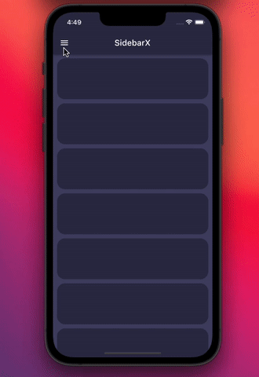
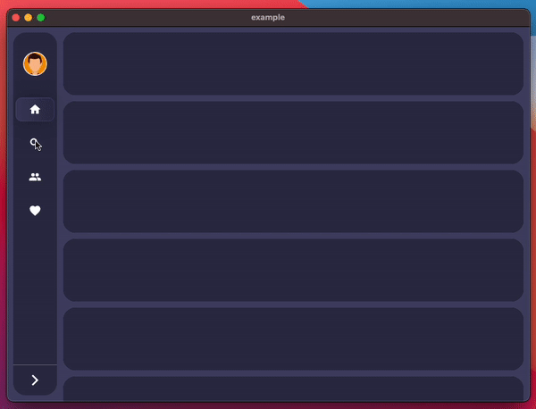
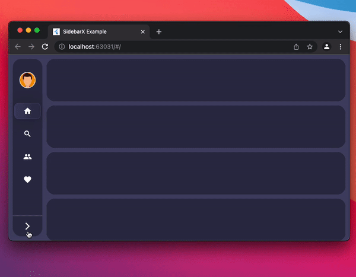

<h1 align="center">
  SidebarX 🔥
</h1>

<h2 align="center"> Flutter multiplatform navigation sidebar / side navigationbar / drawer widget
</h2>
<p align="center">Show some ❤️ and <a href="https://github.com/Frezyx/group_button">star the repo</a> to support the project!</p>

| iOS | Desktop | Web |
| :------------: | :------------: | :------------: |
|  |  |  |

## Getting started
Follow these steps to use this package

### Add dependency

```yaml
dependencies:
  sidebarx: ^0.2.0 #latest version
```

### Add import package

```dart
import 'package:sidebarx/sidebarx.dart';
```

## Easy to use
The package is designed with maximum adaptation to large screens.<br>
Therefore, adding a widget to your screen will be very simple.
```dart
    Scaffold(
      body: Row(
        children: [
          SidebarX(
            controller: SidebarXController(selectedIndex: 0),
            items: const [
              SidebarXItem(icon: Icons.home, label: 'Home'),
              SidebarXItem(icon: Icons.search, label: 'Search'),
            ],
          ),
          // Your app screen body
        ],
      ),
    )
```
## Use with small mobile screens
On small screens and mobile devices, you can use the ready-made Sidebar widget as your application's drawer for excellent UX. 
<br>Otherwise, leave the code unchanged and get the same experience

```dart
    Scaffold(
      drawer: SidebarX(
        controller: SidebarXController(selectedIndex: 0, extended: true),
        items: const [
          SidebarXItem(icon: Icons.home, label: 'Home'),
          SidebarXItem(icon: Icons.search, label: 'Search'),
        ],
      ),
      body: const Center(child: Text('Your app body')),
    )
```

## Additional information
The project is under development and ready for your pull-requests and issues 👍<br>
Thank you for support ❤️

<br>
For help getting started with 😍 Flutter, view
[online documentation](https://flutter.dev/docs), which offers tutorials, 
samples, guidance on mobile development, and a full API reference.